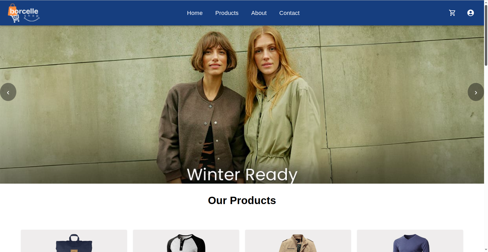
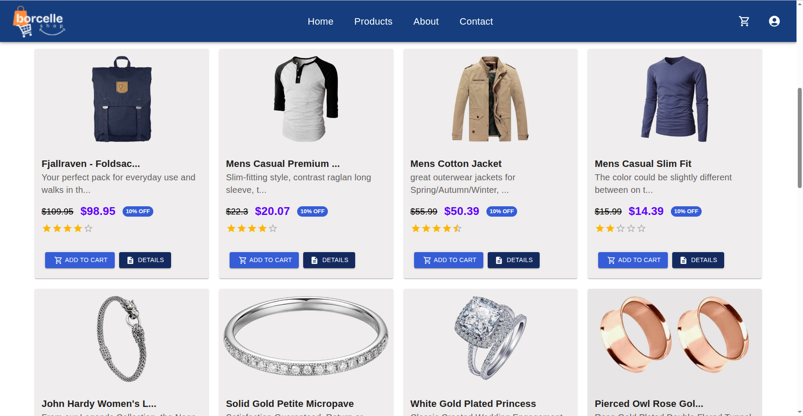
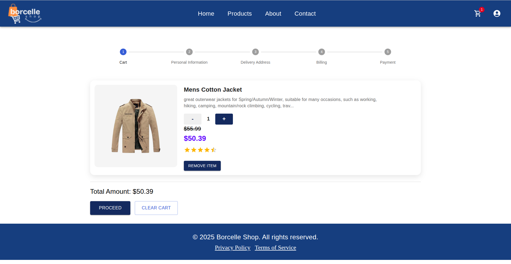
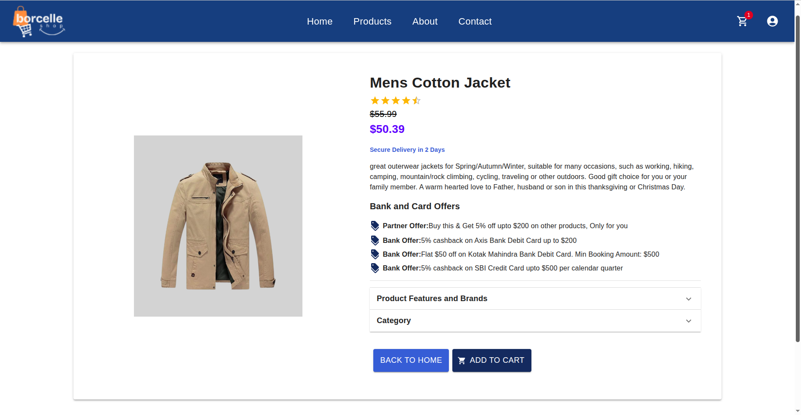

# E-Coomerce Website
Project Name:- E-Commerce Website
Technologies:- React, Redux, Material UI

About:This is a E-Commerce webiste made using React and Redux. website has main product page, cart page and product details page.also website has reusable components like header,footer and slider

# Tech Stack
React.js – Frontend UI library
Redux / Redux Thunk – State management & async actions
Material UI (MUI), Minimal – UI components & design system
Axios – API calls
JavaScript

# Features:
1) Product Management
Fetch products from an API using Axios
Implemented Redux Thunk for asynchronous product fetching
Product listing page with pagination/grid UI
Product details page with additional information

2) Cart Functionality
Add products to cart
Remove a single product from the cart
Remove all products from the cart
Display cart summary (total items, total cost)

3) Billing & Payment Flow
Billing page with user details form
Payment flow integration (dummy/real depending on configuration)
Order summary & checkout experience

4) Logging
Redux middleware to log user actions such as:
Adding/removing products from cart
Navigating between pages
Checkout and order interactions

5) Reusable Components
Header
Footer
Image slider

# Dependencies
1) for redux
npm install react-redux

2) for Axios
npm install axios

3) for redux-thunk
npm install redux-thunk

4) for logger
npm install redux-logger

# Screenshots

1) Product page

2) Cart page

3) ProductDetails Page

